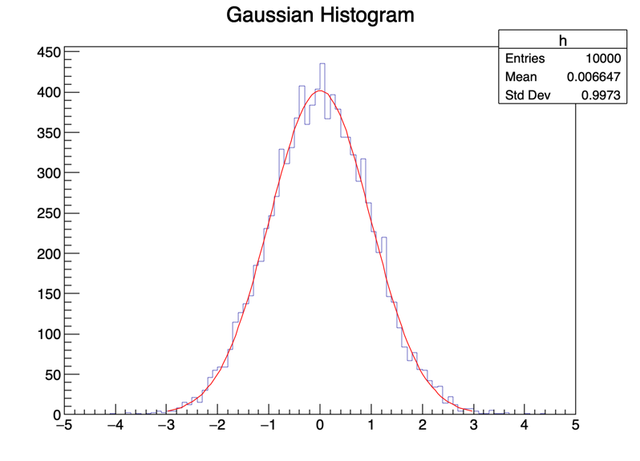
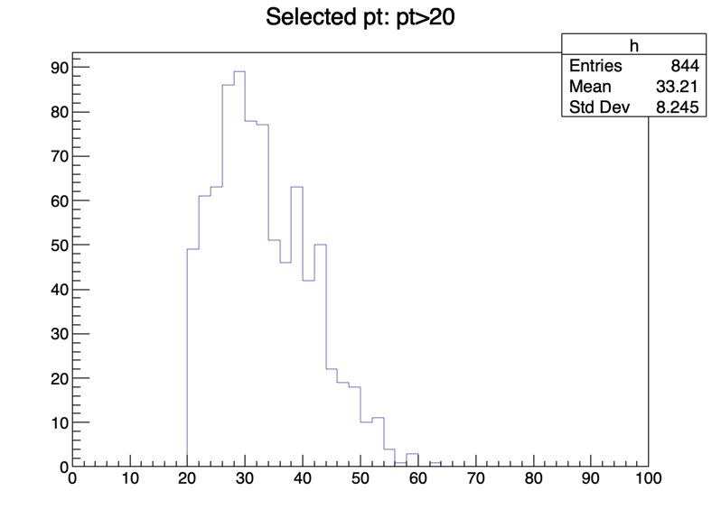
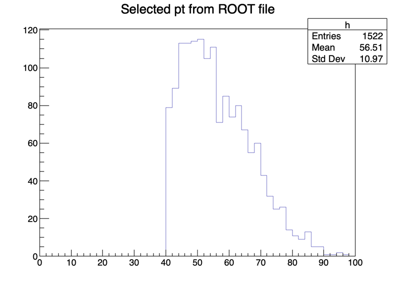
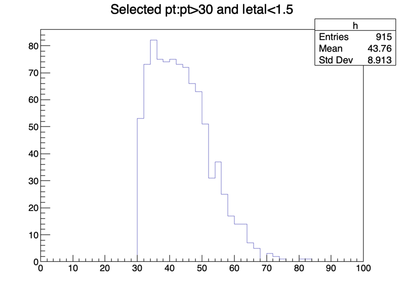

# PyROOT Learning Portfolio

This repository documents my introductory practice with ROOT and PyROOT for scientific data analysis.

I studied physics at the undergraduate level and have been building practical programming and data-analysis skills in preparation for graduate-level research in experimental physics.

The purpose of this repository is to record the PyROOT concepts and analysis workflows that I have practiced directly while learning.

## Topics Covered

### 1. Histogram and Gaussian Distribution
- Creating one-dimensional histograms with `TH1F`
- Filling histograms with Gaussian random numbers
- Understanding bins, underflow, and overflow
- Drawing histograms using `TCanvas`
- Gaussian fitting using `TF1`
- Extracting fitted mean and standard deviation

### 2. TTree and Branch
- Creating a `TTree`
- Creating branches using Python `array`
- Storing event-by-event data using `tree.Fill()`
- Understanding branches and entries

### 3. Event Selection
- Reading entries using `GetEntries()` and `GetEntry()`
- Applying selection conditions such as `pt > 20`
- Filling histograms with selected events

### 4. ROOT File I/O
- Creating ROOT files using `TFile`
- Saving trees using `Write()`
- Reopening ROOT files
- Retrieving stored trees using `Get()`

### 5. Multiple Branches
- Handling variables such as `pt` and `eta`
- Applying combined selection conditions
- Building histograms from selected events

## Repository Structure

| Folder | Practice |
|---|---|
| [`01_histogram`](01_histogram/) | 1D histogram creation and Gaussian fitting |
| [`02_ttree_basic`](02_ttree_basic/) | Basic `TTree`, branch, and entry handling |
| [`03_ttree_cut`](03_ttree_cut/) | Event selection using a simple cut |
| [`04_tfile_io`](04_tfile_io/) | Writing and reading ROOT files |
| [`05_multi_branch`](05_multi_branch/) | Multiple branches and combined selection cuts |
| [`outputs`](outputs/) | Plots generated by the practice scripts |

## Environment

The scripts in this repository were tested with:

- Python
- PyROOT / ROOT 6.38.04
- macOS

## Example Outputs

The following plots were generated by running the practice scripts in this repository.

### 1. Gaussian Histogram and Fit

A Gaussian-distributed dataset was generated, filled into a `TH1F`, and fitted using a Gaussian function.

### 2. TTree Event Selection

Entries were read from a `TTree`, and only events satisfying `pt > 20` were selected and filled into a histogram.

### 3. ROOT File I/O

A `TTree` was written to a ROOT file, reopened, and analyzed after applying a selection condition.

### 4. Multiple Branch Selection

Two branches, `pt` and `eta`, were stored in the same `TTree`, and a combined selection condition was applied.

## Current Status

This is an ongoing learning portfolio.

My current focus is building a solid understanding of ROOT data structures and basic analysis workflows before moving on to real experimental datasets.

## Next Steps

- Practice with publicly available physics datasets
- Improve histogram fitting and statistical interpretation
- Learn more advanced TTree analysis
- Apply PyROOT to particle-physics data-analysis exercises
